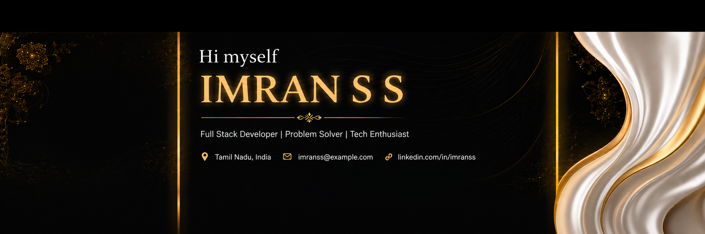

<!-- Responsive Light/Dark Banner -->
<picture>
  
</picture>

# Hey there, I'm IMRAN S S 👋

<!-- Animated Typing Text -->

  

<!-- GitHub Badges -->

  
  
  

 

## ✨ About Me

🔭 I’m currently working on **[Home & Me](https://www.homeandmeconstructions.com/)**, **[Nammauto](http://nammauto.in/)**, and **[Pack Yours](https://pack-yours.vercel.app/)**  
🌐 Check out my main portfolio: **[portfolioimranss.vercel.app](https://portfolioimranss.vercel.app/)**  
🌱 I’m currently learning **Advanced Full-Stack Technologies**  
👯 I’m looking to collaborate on **Open Source & Innovative Web Apps**  
📫 How to reach me: **imranss1309@gmail.com**

 

## 🚀 Tech Stack

  

 

## 📈 GitHub Stats

  
  

 

## 📊 GitHub Activity

  

  

 

## 🐍 Contribution Snake

  <picture>
    <source media="(prefers-color-scheme: dark)" srcset="https://raw.githubusercontent.com/Imran1309/Imran1309/gh-pages/github-contribution-grid-snake-dark.svg">
    <source media="(prefers-color-scheme: light)" srcset="https://raw.githubusercontent.com/Imran1309/Imran1309/gh-pages/github-contribution-grid-snake.svg">
    
  </picture>

 

## 🔗 Connect With Me

  
  
  

 

<!-- Footer -->
<picture>
  <source media="(prefers-color-scheme: dark)" srcset="https://capsule-render.vercel.app/api?type=waving&color=FACC15&height=150&section=footer">
  
</picture>

