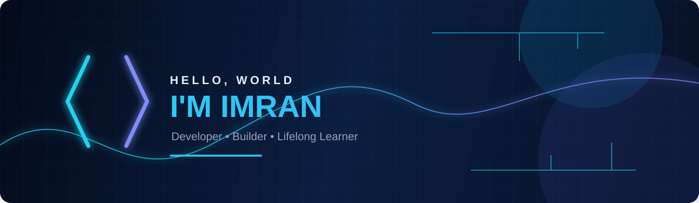
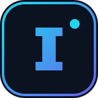

<div align="center">
  
</div>

<div align="center">
  <a href="https://git.io/typing-svg">
    
  </a>
</div>

<div align="center">
  <a href="https://github.com/Imran1309?tab=followers"></a>
  <a href="https://github.com/Imran1309?tab=repositories"></a>
  
</div>

##  About Me

```ts
const imran = {
  username: "Imran1309",
  role: "Developer & lifelong learner",
  interests: ["Web development", "Open source", "Problem solving"],
  motto: "Turn curiosity into useful software."
};
```

I enjoy crafting reliable, approachable software and exploring the ideas behind it. This profile is a living record of what I am learning, building, and sharing with the community.

## ⚡ Tech Stack

<div align="center">
  
</div>

## 📊 GitHub Analytics

<div align="center">
  
  
</div>

<div align="center">
  
  
</div>

## 🐍 Contribution Graph

<div align="center">
  
  <br />
  
</div>

## 🚀 Featured Projects

<div align="center">
  <a href="https://github.com/Imran1309?tab=repositories">
    
  </a>
</div>

> Explore my [repositories](https://github.com/Imran1309?tab=repositories) to see what I am currently building.

## 🤝 Connect With Me

<div align="center">
  <a href="https://github.com/Imran1309"></a>
  <a href="mailto:your-email@example.com"></a>
</div>

<div align="center">
  <sub>Designed with a dark-blue neon pulse ✦</sub>
</div>
